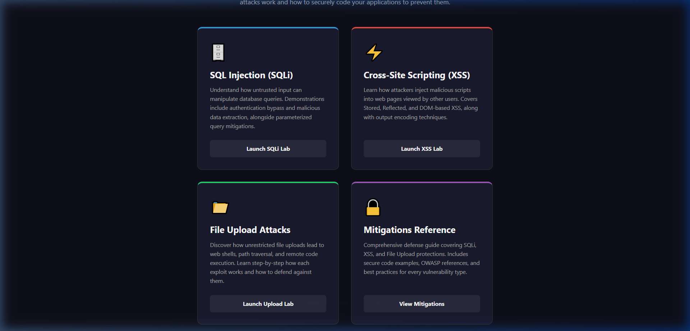
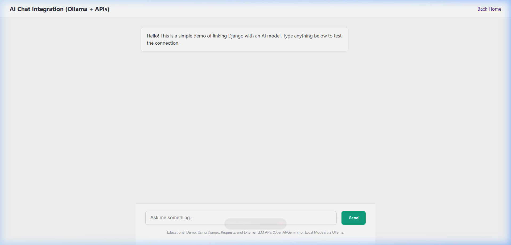

# 🛡️ Django Security & AI Integration Demos

A comprehensive laboratory project designed to demonstrate common web security vulnerabilities and modern AI integration patterns in a Django environment. This project is intended for educational purposes, providing side-by-side "Vulnerable" vs "Secure" implementations for each topic.

---

## 📸 Interface Samples

### Home Dashboard


### AI Integration Lab


---

## 🚀 Features

### 1. 🔐 Security Demos
Understand and mitigate the most common OWASP top 10 vulnerabilities:
- **XSS (Cross-Site Scripting)**: Demos for Stored, Reflected, and DOM-based XSS attacks.
- **SQL Injection (SQLi)**: Examples of vulnerable raw SQL queries vs secure ORM parameterization.
- **Insecure File Upload**: Demonstrates how attackers can bypass file type checks and execute malicious scripts on the server.
- **Authentication Security**: Deep dives into login security and session management.

### 2. 🤖 AI Integration Hub
Connect your Django applications to state-of-the-art Large Language Models:
- **ChatGPT (OpenAI)**: Direct API integration.
- **Google Gemini**: Beta API implementation.
- **Local Ollama**: Integration with local models (like Llama 3) for privacy and zero-cost hosting.
- **Mock Mode**: Simulation tools for testing UI without consuming API credits.

---

## 🛠️ Installation & Setup

1. **Clone the Repository**
   ```bash
   git clone <your-repo-url>
   cd <project-folder>
   ```

2. **Create a Virtual Environment**
   ```bash
   python -m venv venv
   source venv/bin/activate  # On Windows: venv\Scripts\activate
   ```

3. **Install Dependencies**
   ```bash
   pip install -r requirements.txt
   ```

4. **Database Setup**
   ```bash
   python manage.py makemigrations
   python manage.py migrate
   ```

5. **Start the Server**
   ```bash
   python manage.py runserver
   ```

---

## 📁 Project Structure

- `auth_demo/`: Authentication security labs.
- `chatgpt_demo/`: AI integration utilities and views.
- `sqli_demo/`: SQL Injection demonstration app.
- `upload_demo/`: File upload vulnerability labs.
- `xss_demo/`: Stored, Reflected, and DOM-based XSS labs.
- `templates/`: Base UI layout and navigation.

---

## ⚠️ Disclaimer
**This project contains intentionally vulnerable code.** It is meant for local development and education only. **NEVER** deploy the vulnerable portions of this code to a production environment.

## 📄 License
This project is for educational use. Feel free to use it for training and self-learning.
